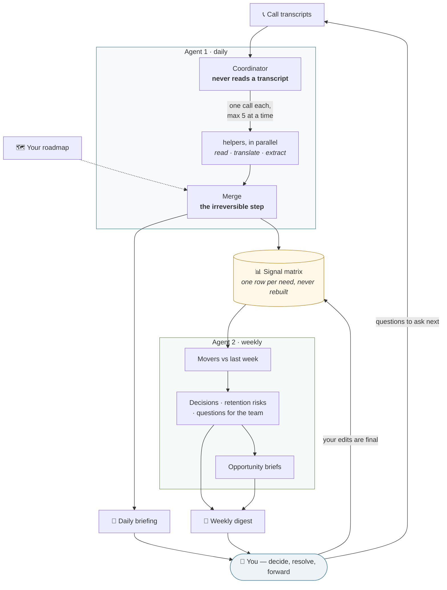

# product-discovery-agents

**Turn call transcripts into an evidence-ranked product backlog — automatically, every day.**

Every week your team has customer calls full of product signal. Somebody asks for a feature.
Somebody says the reporting is unusable for their shift pattern. Somebody mentions, in passing,
that they were promised something six weeks ago.

Then everyone hangs up, and that signal survives only in whoever's memory happens to hold it.
So prioritization becomes an argument about who remembers most confidently — and the loudest
recent call wins.

This is a small system that fixes that. Agents read the calls, extract what customers asked for,
and maintain **one cumulative backlog** where every item carries *who asked, how strongly they
said it, and how many times it has come back*, with their own words attached.

You stop saying *"customers seem to want X."*
You start saying *"six calls, three accounts, two of them made it a deal condition — here are the quotes."*

> **See it before you install it:** [`example-run/`](example-run/) is a complete worked example —
> five fake call transcripts and every artifact the system produced from them. Real output, fake
> companies.

---

## What it produces

| Output | When | What it's for |
|---|---|---|
| **Signal matrix** (`.xlsx`) | updated in place, daily | The accumulated backlog. One row per need, never rebuilt, never duplicated. |
| **Daily briefing** (PDF) | every morning | A 2-minute read: what was asked yesterday, split into new requests, feedback on what you ship, and anything the agent could not classify confidently. |
| **Weekly digest** (PDF) | Fridays | Your working agenda: rank movers, decisions to make, retention risks, and questions to send back to the customer-facing team. |
| **Opportunity briefs** (Markdown + PDF) | when evidence crosses a threshold | A one-page draft — problem, who's asking, quotes, scope sketch, recommendation — ready to grow into a PRD. |

---

## How you actually use it

**This is the part that decides whether the backlog is alive in three months.** A system nobody
has a rhythm for dies quietly. Full version in [`docs/pm-routine.md`](docs/pm-routine.md).

**Daily — 2 minutes.** Open the briefing. Scan for three things only: anything in the *"Needs your
call"* box (answer it today, while the call is fresh), any bug tied to a renewal or open deal, and
anything that makes you say *"wait, we promised what?"*. Then close it. Don't study it — the matrix
absorbed everything either way.

**Friday — 20 to 30 minutes.** The digest is an agenda, not a report. Decide every row in
*"Decisions for you"* (promote / discover / park / resolve conflict). Skim the movers for trend.
**Forward the suggested questions to your sales, onboarding and CS teams** — that one message is
what compounds, because it turns them into your discovery engine for next week.

**Monthly and quarterly.** Bring the matrix to roadmap reviews instead of your memory. Filter
`Not planned` by priority for your candidate list; filter `On roadmap` with high evidence to defend
what you're already building. Let engineering add effort estimates *in the meeting* — evidence from
customers, effort from the builders, decision from you.

**Before any big account call.** Filter the Customers column for that account: everything they have
ever asked for, and how strongly, in one glance.

Two habits keep it honest: **answer the open questions within a couple of days**, and **when you
disagree with a classification, edit the cell** — your edit is permanent and agents never overwrite
it. And one warning: **priority is evidence-weight, not strategy.** A 48 with a huge build cost can
absolutely lose to a 12 that ships next sprint. That call stays yours, deliberately.

---

## How ranking works

```
Priority = (sum of customer importances) × mentions
```

Two inputs, both taken from what customers actually said. Nothing estimated by an agent.

**Stated importance, per customer (1–2)** — a customer appears on a row only if they raised it, so
there is no zero:

- **2 — a consequence is attached.** A deal condition, a pilot success criterion, a hard constraint
  (compliance, IT, works council), a quantified pain, or a renewal risk. Rule of thumb: it would
  appear in the customer's own requirements list.
- **1 — interest without a consequence.** They asked, they liked it, "would be nice." Nothing hangs
  on it.

**Mentions** — how many calls have raised it, cumulatively.

### Why there is no impact or effort score

The first version had them. They were removed, on purpose.

An agent estimating "impact" is just re-encoding what the customer already told you, plus noise.
An agent estimating "effort" is guessing at something only your engineers know. Both dressed
opinion up as data and made the ranking harder to argue with — in the bad way, where nobody can
tell which part was evidence.

So the sheet holds evidence only. Effort enters the conversation where it belongs: in a room with
the people who will build the thing.

---

## What it reports about itself

Nobody should run an automation for months without knowing whether it earns its place. Every run
writes to a **Run metrics** sheet, surfaced in the digest as *"By the numbers"*:

- **Coverage** — calls processed, split across prospect / implementation / customer conversations.
- **Listening time saved** — the **real length of the calls it read**, summed from the duration
  recorded in the ledger. Measured, not assumed. Calls whose length was never captured fall back to
  a configured estimate, and the reports say how many did. The same numbers give you the projection:
  at the rate you are actually running, this is what the system will have read by year end.
- **Backlog health** — signals tracked, new versus merged into existing rows, spread across types.
- **Evidence quality** — the share of ranked signals where at least one customer attached a real
  consequence. This is the number that tells you the ranking follows actual customer problems and
  not enthusiasm.
- **Roadmap coverage** — how much of the demand has no home on your roadmap yet.
- **Decision throughput** — open questions, how long they stay open, briefs drafted and what
  happened to them.

```bash
python3 tools/metrics.py --scope week
```

### What it saved, concretely

From the worked example in this repo — five calls in one week:

| | |
|---|---|
| Calls read | **5** (2 prospect · 1 implementation · 2 customer) |
| **Listening time saved** | **2 h 44 min** — the real length of those calls, summed. Average call **33 min**. Every call measured; nothing assumed. |
| Same figure, in working days | **0.3 days** in one week |
| Signals tracked | **20**, across **4 accounts** |
| Merged rather than duplicated | **4** second mentions landed on an existing row |
| Opportunity briefs drafted | **1**, the moment a human answered an open question |
| Ranking driven by real problems | **70%** of ranked signals have a customer with a consequence attached |
| Demand with no roadmap home | **45%** |
| Your time in | **~15 min/week + 30 min on Friday** |

**The conclusion that matters is the projection.** At the rate this example actually ran —
5 calls a week, 2.7 hours of talk time — the system reads **61 hours of customer conversation by
31 December. That is 7.6 working days.** That is not an estimate of how long you *might* have spent reviewing calls; it is
the measured length of calls somebody would otherwise have had to sit through to get the same
signal, and almost nobody does, which is exactly why the signal is normally lost.

`tools/metrics.py` computes this from the duration recorded in the ledger for every call, and says
plainly how many were measured versus estimated. Run it any time:

```bash
python3 tools/metrics.py --scope week
```

Two things the number does not capture, and I would rather say so than inflate it. Reading a call
properly takes longer than its runtime — you pause, rewind, take notes — so the real saving is
larger. And the hours are still the smaller half of the value: the bigger half is the request you
would have forgotten, the third account that turns a hunch into a decision, and the promise made on
a call that nobody wrote down.

## The agents, and what each one is for

Four actors. Three are automated; the fourth is you, and the system is built so that stays true.

| | Runs | Purpose | Reads | Produces |
|---|---|---|---|---|
| **Agent 1 — Discovery** *(coordinator)* | daily | Turn yesterday's conversations into evidence. Classifies each call, decides what each signal *is* against your roadmap, and merges it into the backlog. | the ledger, your roadmap, and the helpers' findings — **never a transcript directly** | rows in the **signal matrix**, the **daily briefing**, and any open question in **needs-review.md** |
| **Transcript helpers** *(one per call, in parallel)* | inside each daily run | Read one call and come back with facts. Translate if needed, pull the signals, the stated importance and one verbatim quote each. | exactly one transcript | structured findings handed back to the coordinator — they write nothing themselves |
| **Agent 2 — Synthesis** | weekly | Turn accumulated evidence into decisions. Compares against last week, spots what crossed the evidence threshold, and says what needs deciding. | the matrix, the week's briefings, last week's snapshot, your roadmap | the **weekly digest**, **opportunity briefs**, and this week's **snapshot** |
| **You** | 2 min daily · 30 min Friday | Decide. Resolve what the agents refused to guess, promote or park briefs, and forward the questions to the people already talking to customers. | the briefing and the digest | decisions, edits to the matrix (**final — never overwritten**), and next week's questions |

Why split it this way: reading transcripts is mechanical and expensive, so it fans out to a cheap
model in parallel. Deciding what a signal *means* — and especially whether it is the same need as an
existing row — is neither, so it stays with one strong model that never gets handed a transcript to
wade through. And synthesis needs a different altitude than capture, which is why it waits for the
week rather than running daily.

## How it works



More diagrams — a step-by-step of a daily run, how scoring works, and why the merge is guarded —
are in [`docs/architecture.md`](docs/architecture.md).

Three design decisions are worth stealing even if you never run this code:

**The coordinator never reads a transcript.** Agent 1 delegates each call to a cheap model running
in parallel, and keeps only the judgment for itself. Reading transcripts is mechanical and
expensive; deciding what a signal *is* is neither.

**The merge is the one irreversible step.** Deciding "this is the same need as that existing row"
is where the evidence base can be silently corrupted — split one need across two rows and it never
surfaces; fuse two different needs and the count is a lie. So the strongest model does it, it never
gets delegated, and when it is a close call the system keeps rows separate and asks you.

**Agents never guess — they escalate.** If the agent cannot tell whether a capability exists,
whether two requests are the same, or which roadmap item applies, it does not pick a value. It
writes `Unclear — needs <you>`, surfaces it in the briefing, and waits. A backlog quietly
mis-classified is worse than no backlog, because you would trust it.

And one operational detail that matters more than it sounds: **a ledger of processed calls** lives
inside the matrix. It means a call is never counted twice, and a run that was missed — laptop
asleep, scheduler broken, a call skipped — is picked up automatically next time. Runs are
self-healing rather than fragile.

---

## Setup

**Requirements:** [Claude Code](https://claude.com/claude-code), Python 3 with `openpyxl`, and a
Chrome/Chromium for PDF rendering.

```bash
git clone https://github.com/barbararomeira/product-discovery-agents.git
cd product-discovery-agents
./scripts/setup.sh          # creates config.yml, then tells you what to edit
# edit config.yml
./scripts/setup.sh          # creates the matrix and renders scheduling files
./scripts/run_daily.sh      # run it once by hand before scheduling anything
```

In `config.yml` you set your company and internal email domains (that's how the agents tell your
people from customers), who to follow, where transcripts come from, what you already ship, two
brand colours, and your models.

### Where transcripts come from

Two equal options, neither better than the other:

- **[A folder of transcript files](sources/transcript-folder.md)** — any recorder, any export, any
  language. Nothing to integrate. This is what `example-run/` uses.
- **[A call recorder connected directly](sources/call-recorder-mcp.md)** — the agent lists calls and
  pulls transcripts itself. Needs an MCP server for your recorder; Fathom is written up as a worked
  example.

### Scheduling

`setup.sh` renders ready-to-install launchd jobs (macOS); see [`templates/cron.md`](templates/cron.md)
for Linux.

> ⚠️ **If your output folder lives in Google Drive, Dropbox or iCloud**, a scheduled job may be
> unable to *read* it even though it can create files — macOS requires Full Disk Access for the
> shell running the job. This fails silently every morning, which is the worst kind of broken. The
> runners defend against it: they verify a real read before starting, abort cleanly rather than
> write half a result, and log to `failures.log`. Grant Full Disk Access to `/bin/zsh` (System
> Settings → Privacy & Security) if you schedule against a synced folder. *(Yes, this warning exists
> because it happened.)*

---

## What's next

The roadmap for this thing, roughly in order:

1. **Deal-weighted evidence** — pull deal stage and value from a CRM so the digest can say "this gap
   sits in front of £340k of pipeline". Kept deliberately *separate* from the priority formula, so
   evidence and commercial weight stay readable independently.
2. **Promise radar** — commitments made to customers ahead of the roadmap are currently caught in
   passing. They deserve to be a first-class tracked list; in practice this is the highest-value
   thing the system finds, because expectations harden silently and land on product later.
3. **Closing the loop** — when something you prioritized ships, track whether the requests stop and
   whether anyone uses it. Turns the backlog into evidence that the prioritization worked.

Issues and pull requests welcome. If you adopt this and change something meaningful about the
method, I'd genuinely like to hear about it.

## Licence

MIT — see [LICENSE](LICENSE). Use it, fork it, sell what you build with it.
