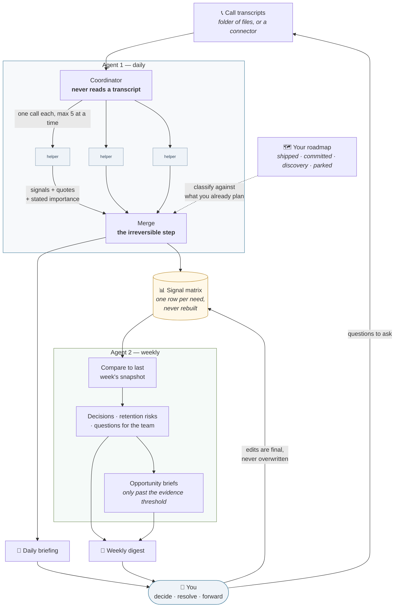
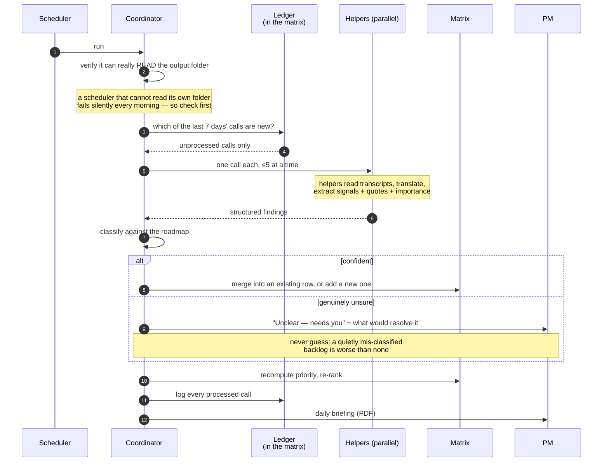
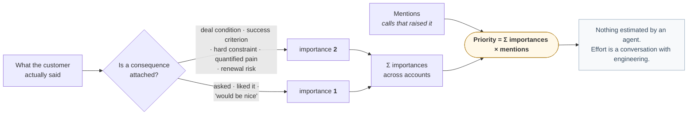
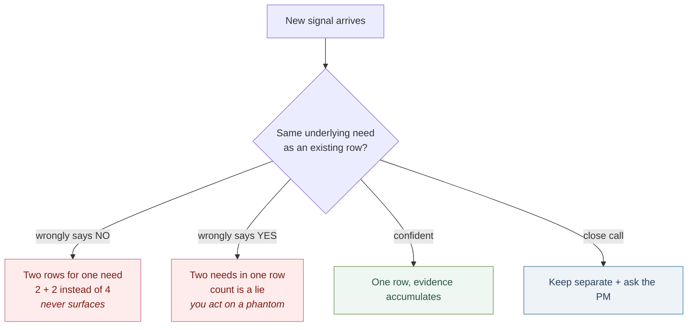
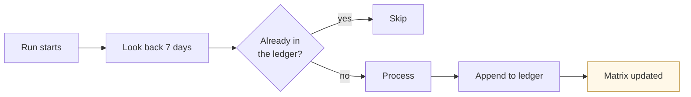

# How the multi-agent system works

Two scheduled agents, a fan-out of short-lived helpers, and one file that accumulates.
Everything below is rendered by GitHub — no images to keep in sync.

---

## The whole system

The loop closes through you, and that is the point: the system prepares decisions, it does not make
them. The arrow back to transcripts is the one that compounds — the questions the digest hands you
become next week's calls.

---

## A daily run, step by step

---

## How a signal is scored

---

## Why the merge is guarded

The merge decides whether a new signal is *the same need* as an existing row. It is the only step
that can silently corrupt the evidence base, and it fails in two directions:

That is why the merge stays with the strongest model, never gets delegated to a helper, and prefers
"keep them separate and ask" over a confident guess.

---

## What makes runs safe to repeat

Two consequences worth knowing: you can run it by hand any time without double-counting anything,
and a missed day — laptop asleep, scheduler broken, a call skipped — heals itself on the next run
rather than being lost.
