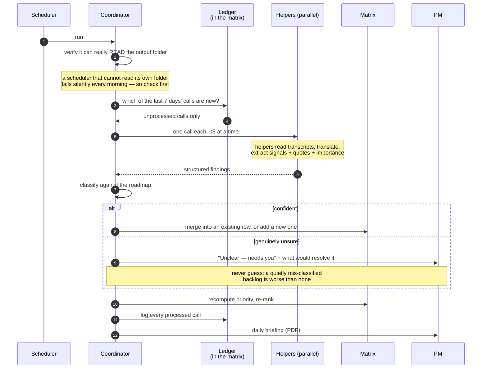
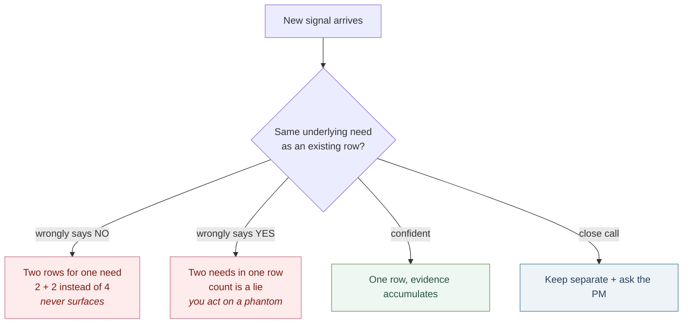
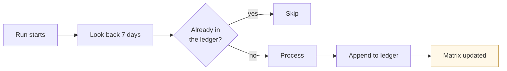
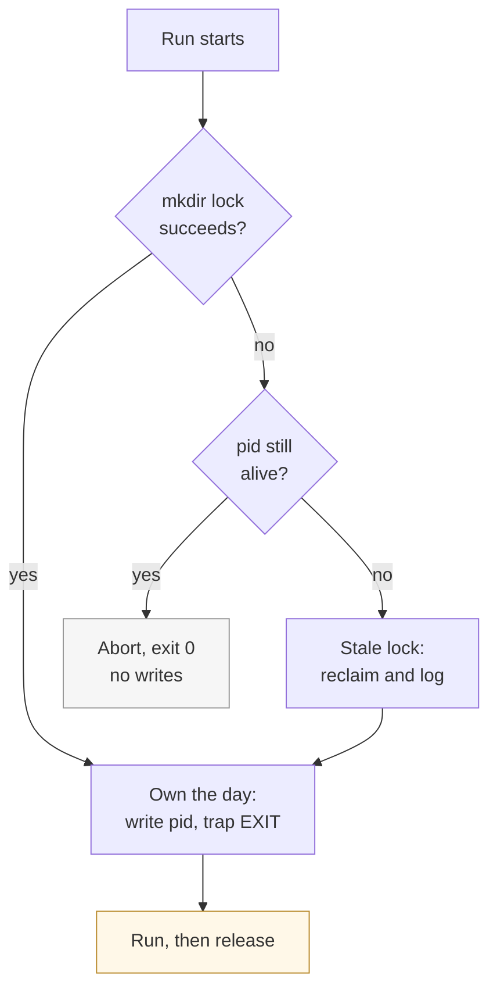

# How the multi-agent system works

Two scheduled agents, a fan-out of short-lived helpers, and one file that accumulates.
Everything below is rendered by GitHub — no images to keep in sync.

---

## Who does what

| | Cadence | Model | Job | Never does |
|---|---|---|---|---|
| **Agent 1 — Discovery** | daily | **Opus 5** — judgement, and the merge is irreversible | Classify each call, judge each signal against the roadmap, merge into the matrix, write the briefing | read a transcript itself; guess when unsure |
| **Transcript helpers** | one per call, ≤5 at a time | **Sonnet 5** — long input, mechanical extraction, runs ~250×/year | Read one transcript, translate, return signals + importance + one quote each | write to the matrix or make a classification decision |
| **Agent 2 — Synthesis** | weekly | **Opus 5** — decisions someone will act on | Compare to last week, decide what crossed the threshold, draft briefs, write the digest | touch the ledger or re-extract from calls |
| **You** | 2 min daily · 30 min Friday | — | Resolve open questions, promote or park, forward the questions to the team | get asked to read the matrix end to end |

The model split is deliberate: the cheap model does the reading, the strong model makes the two
decisions that are hard to undo — what a signal means, and whether it is the same need as an
existing row. Set them in `config.yml` under `models:`. If you move the coordinator down to save
cost, the failure mode to watch for is near-duplicate rows appearing in the matrix; it shows up
within a week.

**Outputs, one line each.** Daily briefing = what was said yesterday and what needs you today.
Signal matrix = the accumulated evidence, one row per need. Weekly digest = this week's decisions.
Opportunity brief = the seed of a PRD, drafted only when the evidence justifies it.
`needs-review.md` = everything the agents refused to guess.

## The whole system

The loop closes through you, and that is the point: the system prepares decisions, it does not make
them. The arrow back to transcripts is the one that compounds — the questions the digest hands you
become next week's calls.

---

## A daily run, step by step

---

## How a signal is scored

---

## Why the merge is guarded

The merge decides whether a new signal is *the same need* as an existing row. It is the only step
that can silently corrupt the evidence base, and it fails in two directions:

That is why the merge stays with the strongest model, never gets delegated to a helper, and prefers
"keep them separate and ask" over a confident guess.

---

## What makes runs safe to repeat

Two consequences worth knowing: you can run it by hand any time without double-counting anything,
and a missed day — laptop asleep, scheduler broken, a call skipped — heals itself on the next run
rather than being lost.

### Repeatable is not the same as concurrent

The ledger makes a run safe to *repeat*. It does nothing to make two runs safe to *overlap*, and
those are different guarantees that are easy to confuse — the second sounds like a consequence of
the first and is not.

Overlapping runs share a failure the ledger cannot see: both read it before either writes it, so
both conclude the day is unprocessed, and both go on to write the same workbook from two processes
and deliver the same messages twice. Idempotence protects the *record*; it protects nothing that
happens before the record is written.

This is not theoretical. A catch-up run started by hand was still working when the scheduler fired
the regular run an hour later. Nothing prevented it. The second run happened to inspect the ledger,
notice the day was already done and abort itself — judgement standing in for a lock, on a day it
happened to reason well.

`mkdir` is the lock because it is atomic on every POSIX filesystem, which `flock` is not — absent
from stock macOS, unreliable over network mounts. The PID inside distinguishes a live run from a
crashed one, because **a lock that outlives its holder is an outage**: refusing forever on a stale
directory turns a crash into a permanent failure, which is a worse bug than the one being fixed.

### Two guard failures worth designing against

**A guard that is written but never called.** A preflight check existed for five days — built
specifically to turn an hour-long hang into a fifteen-second abort — and no runner ever invoked it.
It sat in the directory through four more hangs while the thing it prevented kept happening. Nothing
detects this: the file is present, it is correct, its tests pass, and it is dead code. If a guard
matters, something must fail when it is missing; otherwise the only evidence it is wired is that
somebody remembers wiring it.

**A reference that goes stale without saying so.** The knowledge cache above carries a freshness
rule. The reference files beside it did not, and sat weeks behind while every run still cited them
as authoritative. The worst case was the one most likely to change: a document edited by hand,
upstream, by people with no idea a pipeline depended on it.

The rule that falls out: **every mirrored reference carries its own `Refreshed:` date and its own
rule, or it is not a mirror — it is a copy that was accurate once.** A stale source raises no error.
It produces confident, well-formatted, sourced output that is out of date, which is the hardest kind
of wrong to notice.
